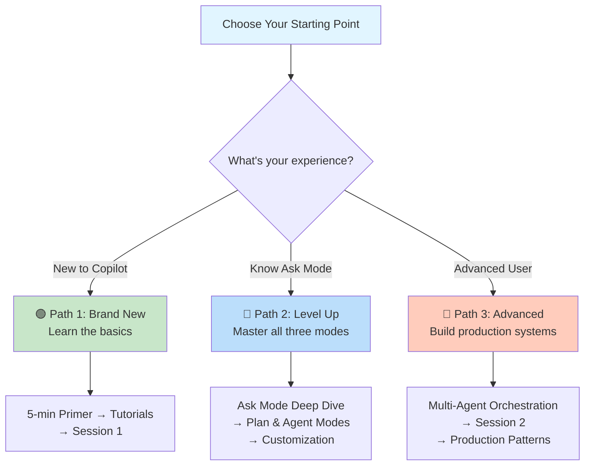

# Learning Paths: Choose Your Adventure

> Different goals, different starting points. Pick the path that matches your situation, follow it, and level up.

---

## 🎯 Which Path Is For You?

Take 10 seconds to find yourself:



### Path 1: "I'm Brand New to GitHub Copilot"
You've never used Copilot. You may or may not have heard of it. You want to understand what it is, play with it a bit, and get the basics right.

**→ [Start with this path](#path-1-brand-new-to-copilot)**

---

### Path 2: "I Know Ask Mode; I Want to Level Up"
You've used Ask mode a bit. You're comfortable with basic chatting but don't know about Plan mode, Agent mode, or customization. You want to use Copilot for bigger tasks.

**→ [Start with this path](#path-2-level-up-ask-to-agent)**

---

### Path 3: "I Want to Build Advanced Workflows"
You understand the three modes. You want sub-agents, custom agents, orchestration patterns, and production workflows. You're ready to make Copilot work for your team.

**→ [Start with this path](#path-3-advanced-workflows)**

---

### Path 4: "I Just Want Quick Answers"
You don't want to read long guides. You have specific questions and want 1-2 sentence answers.

**→ [FAQ_For_Beginners.md](FAQ_For_Beginners.md)**

---

---

## Path 1: Brand New to Copilot

> **Duration:** 30-45 minutes | **Goal:** Understand Copilot, try all three modes, build confidence

### Stage 1: What Is This Thing? (5 min)
1. Read: [Getting_Started_Primer.md](Getting_Started_Primer.md) - Overview of the three modes
2. **Time check:** You now know Ask, Plan, and Agent exist and when each is useful

### Stage 2: Try Ask Mode (10 min)
3. Read: [Getting_Started_Primer.md#mode-1](Getting_Started_Primer.md#mode-1--ask-your-first-copilot-conversation-2-minutes) - "Try It Now" section
4. **Do it:** Follow the steps. Open VS Code, press Ctrl+I, ask `@workspace explain this codebase`
5. **Time check:** You've had your first chat with Copilot

### Stage 3: Understand When to Use Each Mode (10 min)
6. Read: [FAQ_For_Beginners.md#ask-mode](FAQ_For_Beginners.md#-ask-mode) - Ask vs Plan vs Agent comparison table
7. Skim: [Session1_Building_The_Foundation.md#part-1](Session1_Building_The_Foundation.md#part-1-the-three-interaction-modes) - Full comparison (part of bigger document; you'll come back to this later)
8. **Time check:** You understand the three modes at a high level

### Stage 4: Try Plan Mode (8 min)
9. Read: [FAQ_For_Beginners.md#when-should-i-use-plan-mode](FAQ_For_Beginners.md#when-should-i-use-plan-mode) - How to use Plan mode
10. **Do it:** Open chat, type `/plan`, describe a small feature ("Add a button that toggles dark mode"), review the plan
11. **Time check:** You've created and reviewed a plan

### Stage 5: The Most Important Concept (5 min)
12. Read: [FAQ_For_Beginners.md#common-first-mistakes](FAQ_For_Beginners.md#-common-first-mistakes) - Learn what to *avoid*
13. **Time check:** You know the pitfalls

### ✅ You're Ready For
- Asking Copilot questions daily
- Using Plan mode for new features
- **Next step:** [Path 2](#path-2-level-up-ask-to-agent) when you want to learn Agent mode and customization

---

---

## Path 2: Level Up - Ask to Agent

> **Duration:** 1-2 hours | **Goal:** Master all three modes, understand context engineering, start using Agent mode

### Prerequisites
You should already:
- ✅ Know what Ask mode is
- ✅ Have Copilot installed and working
- ✅ Be comfortable opening chat and asking questions

**Not there yet?** → [Path 1](#path-1-brand-new-to-copilot) first.

---

### Stage 1: Deep Dive on Ask Mode Context (15 min)
1. Read: [Session1_Building_The_Foundation.md#part-2](Session1_Building_The_Foundation.md#part-2-chat-context-and-prompting) - Chat context, the POWER framework, debug view
2. **Hands-on:** Try the POWER framework on a real question: Purpose (what I want), Operating Context (my tech stack), What Constraints (rules), Expected Format (how I want output), Role (expertise level)
3. **Time check:** You know *why* some prompts work better than others

### Stage 2: Plan Mode Deep Dive (20 min)
4. Read: [Session1_Building_The_Foundation.md#plan-mode](Session1_Building_The_Foundation.md#plan-mode--design-first-code-second) - The four-step flow and best practices
5. **Hands-on:** Plan a real feature from your codebase. Follow: Describe → Review → Refine → Execute. Don't skip the refine step.
6. **Time check:** You understand why Plan mode prevents wasted work

### Stage 3: Agent Mode (20 min)
7. Read: [FAQ_For_Beginners.md#agent-mode](FAQ_For_Beginners.md#-agent-mode) - What Agent does and safety
8. Read: [Session1_Building_The_Foundation.md#agent-mode](Session1_Building_The_Foundation.md#agent-mode--autonomous-multi-step-execution) - Full capabilities and limitations
9. **Hands-on:** Use Agent mode for a small task (write a test file, create a utility function with tests, add a simple feature)
10. **Time check:** You've used all three modes on real work

### Stage 4: Context Engineering Intro (15 min)
11. Read: [FAQ_For_Beginners.md#context-engineering](FAQ_For_Beginners.md#context-engineering--advanced) - What it is, why it matters
12. Skim: [Session1_Building_The_Foundation.md#part-3](Session1_Building_The_Foundation.md#part-3-from-prompt-engineering-to-context-engineering) - The shift from prompts to context
13. **Time check:** You understand that context design is more powerful than prompt wording

### Stage 5: Debug View Mastery (10 min)
14. Read: [Session1_Building_The_Foundation.md#the-chat-debug-view](Session1_Building_The_Foundation.md#the-chat-debug-view) - What to look for
15. **Hands-on:** Open debug view in a real Copilot chat. See exactly what was sent to the model. Ask: "Where's that file I expected?" See how context is assembled.
16. **Time check:** You can diagnose unexpected behavior

### ✅ You're Ready For
- Complex multi-file tasks with Agent mode
- Understanding *why* suggestions are good/bad using debug view
- **Next step:** [Path 3](#path-3-advanced-workflows) when you want customization, sub-agents, and team-level patterns

---

---

## Path 3: Advanced Workflows

> **Duration:** 2-3 hours | **Goal:** Customize Copilot for your team, use sub-agents, build production workflows

### Prerequisites
You should already:
- ✅ Know Ask, Plan, and Agent modes
- ✅ Understand context engineering basics
- ✅ Be comfortable with the debug view
- ✅ Have worked with Agent mode on real tasks

**Not there yet?** → [Path 2](#path-2-level-up-ask-to-agent) first.

---

### Stage 1: Custom Instructions (20 min)
1. Read: [Session1_Building_The_Foundation.md#custom-instructions](Session1_Building_The_Foundation.md#part-3-from-prompt-engineering-to-context-engineering) - What they are, when to use them
2. **Hands-on:** Create a `.instructions.md` file in your repo. Document your team's coding style, tech stack preferences, testing practices. Add it to the repo root.
3. **Verify:** Open a new chat and ask Copilot about best practices. It should cite your instructions.
4. **Time check:** Copilot now knows your team's standards

### Stage 2: Prompt Files (20 min)
5. Read: [Session1_Building_The_Foundation.md](#prompt-files) - Reusable templates, slash commands
6. **Hands-on:** Create a `.prompt.md` file with a reusable template (e.g., "Generate a test file following our conventions"). Add slash-commands like `/test`, `/security-review`.
7. **Verify:** Open chat, type `/test`, see your prompt template fire up.
8. **Time check:** Your team has standardized prompts as shortcuts

### Stage 3: Custom Agents (30 min)
9. Read: [Session1_Building_The_Foundation.md](#custom-agents) - Agent file structure, frontmatter
10. Read: [FAQ_For_Beginners.md#custom-agents](FAQ_For_Beginners.md#part-3) - Why you'd create one
11. **Hands-on:** Create `.agent.md` files for specialized roles:
    - Security Agent (`tools: ['read']`, trained on security best practices)
    - Testing Agent (`tools: ['edit', 'terminal']`, trained on test writing)
    - Code Reviewer (`tools: ['read']`, trained on code review patterns)
12. **Verify:** Select from the agent dropdown in chat. Each should have its own personality and constraints.
13. **Time check:** You have specialized AI personas for different roles

### Stage 4: Sub-Agents & Orchestration (30 min)
14. Read: [Session2_Advanced_Agent_Capabilities.md#part-1](Session2_Advanced_Agent_Capabilities.md#part-1-sub-agents--agent-orchestration) - What subagents are, orchestration patterns
15. **Concept:** Create a Coordinator agent that spawns Workers:
    - Coordinator: Decides what to do
    - Planner (worker): Creates the plan
    - Implementer (worker): Writes code
    - Reviewer (worker): Reviews code
16. **Hands-on:** Create these four `.agent.md` files with handoffs between them
17. **Verify:** Invoke the Coordinator with a vague request ("Build a login feature"). It should delegate to workers, collect results, and coordinate.
18. **Time check:** You can orchestrate teams of AI agents

### Stage 5: Agent Hooks & Governance (20 min)
19. Read: [Session2_Advanced_Agent_Capabilities.md](#agent-hooks) - Lifecycle hooks for security, quality gates (if available in your version)
20. **Hands-on:** Create a `hooks.json` file that enforces standards:
    - On every Agent execution: check for security issues
    - On every code generation: run linting
    - Before commit: verify tests pass
21. **Verify:** Run Agent mode and see hooks execute at lifecycle events
22. **Time check:** Your Copilot workflows are governed by quality gates

### ✅ What You Can Now Do
- ✅ Build feature-complete workflows with Ask → Plan → Agent
- ✅ Spawn specialized AI agents (Security, Testing, Review) to handle different concerns
- ✅ Coordinate multi-agent workflows that check quality before shipping
- ✅ Share customizations with your team via version control
- **Next step:** Monitor Agent HQ for production workflows, explore Background Agent Sessions

---

---

## Path 4: Quick Answers (No Structured Path)

> You're here to answer a specific question, not take a course.

**Go to:** [FAQ_For_Beginners.md](FAQ_For_Beginners.md)

Ctrl+F your question. Get a 1-2 sentence answer. Done.

---

---

## 🎓 Recommended Full Journey (All Paths Combined)

If you have **3-4 hours** and want to go deep:

```
Path 1 (30 min) → Path 2 (90 min) → Path 3 (120 min)
     ↓
Foundation → Proficiency → Mastery
```

After this, you'll:
- ✅ Know all three modes intimately
- ✅ Understand context engineering
- ✅ Have set up customizations for your team
- ✅ Be able to orchestrate multi-agent workflows
- ✅ Have production-grade governance in place

---

## 📍 Progress Markers

| Marker | You Know... |
|--------|---|
| 🟢 Path 1 complete | What Ask, Plan, Agent are and when to use each |
| 🟡 Path 2 complete | How to use all three modes effectively and why context matters |
| 🔴 Path 3 complete | How to customize Copilot, create specialized agents, and orchestrate workflows |

---

## 🚀 Ready? Pick a path above and jump in. You've got this.
