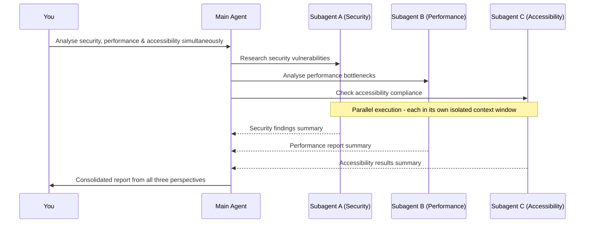
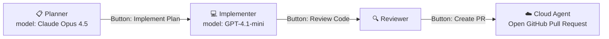
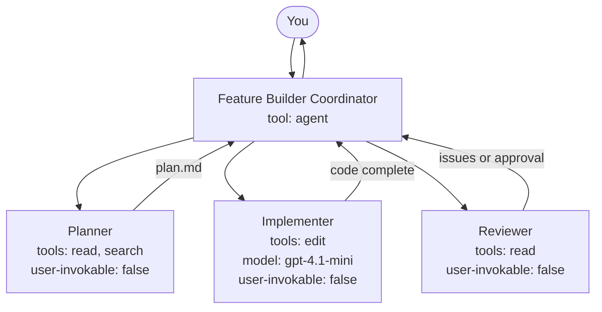
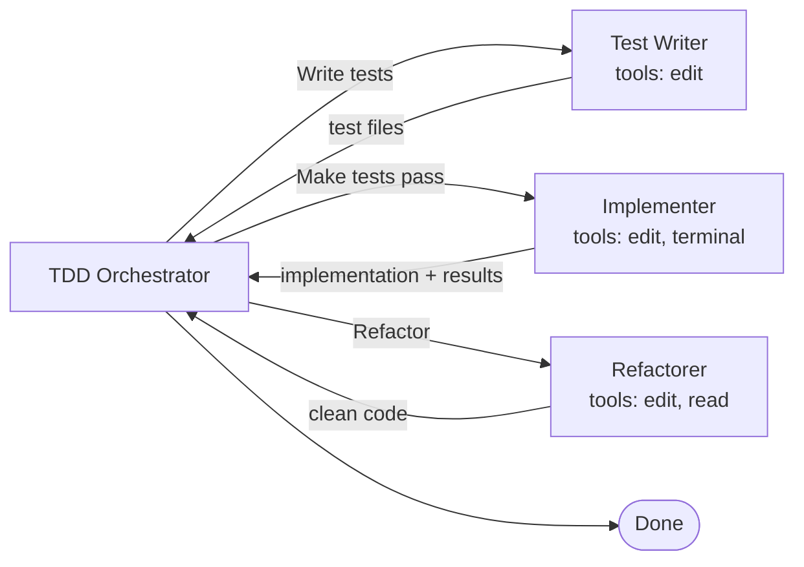

# Session 2: Advanced Agent Capabilities

`[ADVANCED]` - Requires understanding Session 1 first. Skip this if you're new to Copilot.

> **"Low Code or No Code" · "Prompt to Production"**
>
> This session covers the advanced tier of GitHub Copilot's agentic capabilities: coordinating teams of AI specialists with subagents, extending Copilot with auto-discovered domain skills, and governing agent execution with lifecycle hooks. These are the tools that transform Copilot from a coding assistant into a production workflow engine.

⚠️ **Prerequisites:** You should already understand Ask mode, Plan mode, Agent mode, and context engineering from [Session 1](./Session1_Building_The_Foundation.md). If not, read Session 1 first.

---

## What You Will Learn

- **Sub-agents** - what they are, how they differ from new chat sessions, and the three core behaviours
- **Agent orchestration** - coordinator + worker patterns, parallel spawning, and the token arithmetic that makes them powerful
- **Custom agent frontmatter** - the full reference for orchestration control
- **Handoffs** - sequential, user-approved workflows as clickable transitions
- **Agent HQ** - the unified view for managing all running agent sessions
- **Agent Skills** - auto-discovered domain capability bundles that load progressively
- **Agent Hooks** - scripts that execute at lifecycle events to enforce security, quality, and compliance
- When to use each capability and how to combine them in end-to-end workflows

---

## Part 1: Sub-Agents & Agent Orchestration

### The Problem a Single Chat Solves - and the Problem It Creates

A single chat session is powerful for bounded tasks. But complex features span dozens of files, multiple concerns, long context histories, and many phases. When you try to fit all of that into one conversation, the context window fills, responses degrade, and you end up doing coordination work manually - copying outputs between windows, re-setting context, repeating instructions.

Orchestration solves this. Instead of you managing multiple agents manually, one agent manages the others - spawning focused workers, collecting their results, and delivering a unified outcome. You describe what you want at the top level; the orchestrator figures out how to get it done.

---

### What Is a Subagent?

A subagent is a Copilot Chat session that:
1. Runs in complete **isolation** from your main conversation
2. Has its own dedicated **context window** - nothing from your main chat leaks in
3. Does a **specific, bounded piece of work**
4. Returns **only its final summary** to the main agent when done

The main agent - the one you are talking to - is the orchestrator. It spawns subagents, waits for their results, and incorporates those results into its own context. The subagent's working context, with all its intermediate tool calls, file reads, and exploration, disappears when the work is done. Only the conclusion survives.

**Subagent vs. New Chat Session:**

| Property | Subagent | New Chat Session |
|----------|----------|-----------------|
| Relationship to main agent | Connected - reports back | Completely disconnected |
| Context window | Clean, isolated, disposable | Starts fresh, persists |
| Result returned to caller | ✅ Summary returned automatically | ❌ Manual copy/paste |
| Visible in main chat | ✅ Collapsible tool call | ❌ Different window |
| Can use a custom agent | ✅ Specialised tools + model | N/A |

The crucial difference is the **return path**. A subagent's result flows automatically back into your main conversation. A new chat session requires you to copy, switch, and paste - and that friction compounds across a multi-step workflow.

---

### The Three Core Behaviours

**Behaviour 1: Synchronous Execution**

Subagents are synchronous by default - the main agent blocks and waits for each subagent result before proceeding. Subagent findings typically inform the next step, so the orchestrator waits rather than racing ahead with incomplete information.

**Behaviour 2: Parallel Spawning**

VS Code can spawn multiple subagents simultaneously. When you request concurrent analysis - "analyse security, performance, and accessibility simultaneously" - all three run in parallel. The main agent waits for all results before continuing.



**Behaviour 3: Context Isolation**

Each subagent has its own context window that exists only for the duration of its work. When it concludes, that context is gone. Only the final summary is returned.

```
Main conversation context: 10K tokens used
Subagent 1 (file analysis):  consumed 45K tokens, returned 2K summary
Subagent 2 (code generation): consumed 80K tokens, returned 5K implementation
Net cost to main context: 10K + 2K + 5K = 17K tokens
```

Without subagents, those 125K tokens would all be in your main context. The work is the same; the architecture is different. Quality goes up (fresh contexts), cost to the main session goes down, and the scope of what you can accomplish without hitting context limits multiplies.

> **One nesting constraint:** subagents cannot spawn their own subagents. Delegation is exactly one level deep. The orchestrator coordinates; workers execute.

---

### Custom Agent Frontmatter - Full Reference

The custom agent file (`.agent.md`) is the control plane for orchestration. Its YAML front matter defines the agent's behaviour, tools, and orchestration role.

```yaml
---
name: Feature Builder             # Display name. Required.
description: >                    # Used by other agents to decide when to call this one.
  Builds features by coordinating research and implementation.
tools:                            # Tools available to this agent.
  - agent                         # Required to spawn subagents.
  - edit
  - search
  - read
  - terminal
agents:                           # Which custom agents this agent may call.
  - Planner                       # List specific names, or use '*' for all.
  - Implementer
  - Reviewer
user-invokable: true              # false = hidden from dropdown; subagent-only.
disable-model-invocation: false   # true = cannot be called as subagent by others.
model: claude-opus-4-5            # Preferred model. Array tries in order.
handoffs:                         # Clickable buttons after response completes.
  - label: "Implement this plan"
    agent: Implementer
    prompt: "Implement the plan outlined above."
    send: false                   # send: false = user confirms; true = auto-submits.
---
```

**Key property decisions:**

- **`tools: ['agent']`** - Without this, the agent cannot spawn subagents. Add it to any orchestrator; omit it from workers.
- **`agents: []`** - Setting this to an empty array prevents subagent spawning even if `agent` is in the tools list.
- **`user-invokable: false`** - Worker agents that should only be called by an orchestrator, not manually from the dropdown.
- **`model` as array** - `['claude-opus-4-5', 'gpt-5.2-codex']` tries models in order; falls back automatically if unavailable.

---

### Handoffs - Sequential, Approved Workflows

Handoffs are **clickable buttons** that appear after an agent produces a response. They let you approve and transition to the next stage with context automatically passed forward.



```yaml
handoffs:
  - label: "Implement this plan"
    agent: Implementer
    prompt: "Implement the plan outlined above. Start with step 1."
    send: false
```

With `send: false`, you see the pre-filled prompt and can edit it before submitting. With `send: true`, the transition fires immediately - useful for fully automated pipelines.

The most powerful handoff pattern is the **quality gate** - a stage where you explicitly approve the output before moving forward. The planner produces a plan. You read it. If it looks right, you click. Nothing happens until you do.

---

### Orchestration Patterns

**Pattern 1: Coordinator + Workers**



**Coordinator:**
```markdown
---
name: Feature Builder
tools: ['agent', 'read']
agents: ['Planner', 'Implementer', 'Reviewer']
---
For any feature request:
1. Use the Planner to produce a commit-level plan.
2. Use the Implementer to write the code for each step.
3. Use the Reviewer to check the implementation.
4. If the reviewer finds issues, return to the Implementer and repeat.
Return a final summary of what was built.
```

**Pattern 2: Parallel Analysis**

Three subagents analyse the same codebase simultaneously from different angles, then the orchestrator synthesises the findings - security, performance, and accessibility in parallel.

**Pattern 3: Test-Driven Development Orchestration**



Follow strict TDD: write failing tests → write minimum code to pass → refactor to match patterns → repeat.

**Pattern 4: Research Delegation**

Delegate expensive research to an isolated context, receive a clean summary. The research subagent can read 40+ files and spend 50K tokens. Your main conversation pays 2K for the summary.

---

### Agent HQ and the Agent Sessions View

Agent HQ (introduced in VS Code 1.107) is the unified view for managing all running agents - local Copilot agents, background cloud agents, and third-party agents - in the **Agent Sessions view** in the Activity Bar.

- **View all active sessions** - local, background, and cloud agents in one list
- **See status indicators** - which agents are running, waiting, or complete
- **Cancel a session** without losing partial results
- **Switch between sessions** without losing context in any of them

**Background agents** continue working even when you switch to a different session or minimise VS Code. Kick off a long-running generation task, note the session ID in Agent Sessions, and check back when it completes.

**Local vs. Cloud Agents** (as of VS Code 1.109):

| Agent Type | Where It Runs | Best For |
|-----------|--------------|----------|
| Local Copilot agent | Your machine | Standard coding, rapid iteration |
| Background cloud agent | GitHub cloud | Long-running generation, CI/CD integration |
| Claude (local mode) | Your machine | Specialised Claude workflows |
| Codex (local mode) | Your machine | Code-focused OpenAI tasks |

---

### Prompt Engineering for Subagent Instructions

**Be specific about what to return.** The orchestrator can only use what the subagent returns. Vague instructions produce vague results.

```markdown
# Vague:
Analyse the authentication code and tell me what you find.

# Specific:
Analyse /src/auth/. Return:
1. Security vulnerabilities found (if any)
2. Deviations from OWASP recommendations (if any)
3. A one-sentence overall assessment
Return nothing else. If no issues found, say "None found."
```

**Limit the scope.** Subagents should do one thing well. Send three focused subagents rather than one broad one.

**Specify the model when it matters.** Workers doing straightforward tasks do not need your most capable model. Reserve expensive models for judgment tasks.

```yaml
name: Implementer
model: gpt-4.1-mini    # Fast and cheap for execution tasks
```

---

### When to Use Subagents

| Use Subagents When... | Use a Simple Chat When... |
|-----------------------|--------------------------|
| Task has distinct phases, each requiring significant context | Task is bounded and fits in one context window |
| Multiple concerns need simultaneous analysis | You are iterating quickly on a small change |
| A subtask requires deep exploration (40+ files) | Orchestration setup overhead exceeds the value |
| A worker needs different tool permissions | You need every intermediate step in your main conversation |
| A worker benefits from a different model | |

---

### VS Code Release History for Orchestration

| Version | Date | What Shipped |
|---------|------|-------------|
| v1.105 | Sep 2025 | Subagents via `#runSubagent`; plan agent with handoffs |
| v1.107 | Nov 2025 | Agent HQ, background agents, Agent Sessions view |
| v1.109 | Jan 2026 | Multi-agent stable; parallel subagents; Claude + Codex as local agents |
| v1.110 | Feb 2026 | Agentic browser tools; `/compact` context compaction |
| v1.111 | Mar 2026 | Agent permissions (Autopilot mode); agent-scoped hooks; `/troubleshoot` |

---

## Part 2: Agent Skills

### Why Skills Exist

Custom instructions, prompt files, and custom agents all share a common liability: **everything is text**, and text has to be loaded upfront. None of them can execute scripts, reference templates as live runtime resources, or load progressively based on need.

Agent Skills solve all of these problems simultaneously. They are:
- Loaded **only when needed** - the agent discovers and activates them on demand
- Loaded **only as much as needed** - metadata first, full instructions only when relevant
- Bundled with **scripts** and **templates** - executable, not just instructional

### The Progressive Loading Model

On each request, the system prompt includes a skill registry section at the very end:

```
Skills: Here is a list of skills that contain domain-specific knowledge.
When a skill is relevant to the user's request, read the skill file.

- pdf: Process and extract content from PDF files.
  path: .github/skills/pdf/SKILL.md
- excel-reporter: Generate Excel reports from data sources.
  path: .github/skills/excel-reporter/SKILL.md
```

That's ~100–200 tokens per skill. No instructions. No scripts. Just names, descriptions, and file paths.

When a request matches a skill, the agent reads the full `SKILL.md` (~2–5K tokens). If the SKILL.md references a script, the agent reads and runs that script. Total cost on requests that don't need a skill: near zero.

**Compare: custom instructions vs. skills**

If you put PDF processing instructions into a custom instruction file, you pay 3–6K tokens on *every* request, forever. With skills, you pay that cost only when a PDF is actually being processed.

---

### The SKILL.md File

Every skill requires exactly one entry point: `SKILL.md`, in a named folder in a recognised skills directory.

**Valid locations:**
```
.github/skills/<skill-name>/SKILL.md
.copilot/skills/<skill-name>/SKILL.md
```

**Required front matter:**

```yaml
---
name: pdf
description: |
  Use this skill when working with PDF files of any kind. Triggers include:
  reading or extracting text from PDFs, merging or splitting PDFs, rotating pages,
  adding watermarks, extracting images, filling PDF forms, or OCR on scanned PDFs.
  If the user mentions a .pdf file or asks to produce one, use this skill.
---
```

Two fields are mandatory: `name` and `description`. The description is the most critical field in the file - it is what the AI reads before loading anything else, and it determines when the skill is activated.

**Writing an effective description:**
- Be explicit about trigger conditions: "Use this skill when..."
- List the specific tasks the skill supports
- Include file types or keywords that should activate it
- 50–200 words - precise, not exhaustive

**The skill body** (after the front matter) gives the agent instructions for how to use the skill:

```markdown
# PDF Processing Skill

## When to Use
- User wants to read or extract text from a PDF
- User wants to combine multiple PDFs
- User asks about OCR or scanned document text

## Processing Approach

1. Check if `markitdown` is available: `python -m markitdown --version`
2. Extract PDF content: `python -m markitdown [filepath]`
3. If markitdown is unavailable, install it: `pip install markitdown`
4. Use the extracted text to answer the user's question

## Limitations
- Scanned PDFs with no embedded text layer may not extract cleanly
- Very large PDFs (200+ pages) should be processed in chunks
```

---

### Bundling Scripts and Templates

A skill with only a `SKILL.md` is useful. A skill with supporting scripts and templates is **powerful**. The difference: a skill that gives instructions vs. a skill that *executes*.

**The modular skill structure:**

```
.github/skills/
  excel-reporter/
    SKILL.md
    scripts/
      generate_report.py
      validate_data.js
    templates/
      REPORT_TEMPLATE.xlsx
      HEADER.md
    README.md
```

Reference scripts with relative paths from the SKILL.md file:

```markdown
## Generating a Report

Run the following script to generate the Excel report:

```
scripts/generate_report.py --input [data_file] --template templates/REPORT_TEMPLATE.xlsx
```
```

Files only load when the agent reaches that instruction - progressive loading in action.

**PPTX skill example** - a routing SKILL.md that loads different guides for different tasks:

```markdown
# Presentation Skill

| Task | Guide |
|------|-------|
| Read or analyse content | `python -m markitdown presentation.pptx` |
| Edit an existing presentation | Read [editing.md](editing.md) |
| Create from scratch | Read [pptxgenjs.md](pptxgenjs.md) |
```

The agent reads SKILL.md and gets a routing table. `editing.md` only loads if the task is editing. `pptxgenjs.md` only loads if the task is creation. Neither guide is loaded unless the specific task requires it.

---

### Progressive Loading in Practice - Token Costs

| Stage | What Loads | Approximate Token Cost |
|-------|-----------|----------------------|
| Registry entry | Name, description, path | 50–150 tokens |
| SKILL.md (entry point) | Instructions, routing table | 500–3,000 tokens |
| A referenced guide | One operational guide | 1,000–5,000 tokens |
| A script | Script content | 300–2,000 tokens |
| A template | Template content | 200–1,000 tokens |

For a complex skill, maximum load in one session might be 10–15K tokens - but only when the skill is used, and only the parts relevant to the specific task.

---

### Skill Discovery and Activation

On every request, VS Code reads the skills directories and assembles the registry automatically. No configuration required - put the skill folder in the right location and it appears.

The language model reads the registry and compares descriptions to the user's request. This is **semantic understanding**, not keyword matching. The model asks: "Given this user request, is this skill relevant?"

Verify skill discovery at any point:

```
What skills do you have available?
```

The agent will list all skills it found in the registry - the same registry view it uses internally.

---

### Building a Complete Skill - Step by Step

```
Step 1: Create the folder
  mkdir -p .github/skills/system-info/scripts

Step 2: Write the script
  .github/skills/system-info/scripts/get-system-info.js

Step 3: Write the SKILL.md with front matter + workflow instructions

Step 4: Test - ask Copilot "What is my system information?"
         The agent finds the skill, reads SKILL.md, runs the script, presents results
```

---

### Installing Community Skills

- **`github.com/github/awesome-copilot`** - community-contributed skills, searchable by technology
- **`github.com/anthropics/skills`** - Anthropic's official reference implementations
- Install by copying the skill folder into `.github/skills/` in your project

Verify after installation:

```bash
# In your VS Code terminal, confirm the folder is in place
ls .github/skills/

# Then ask Copilot:
What skills do you have available?
```

---

### Skills vs. Other Primitives - Decision Guide

| Use Case | Primitive |
|----------|----------|
| Team uses specific API patterns on every project | Custom instruction |
| Run the same planning workflow repeatedly | Prompt file |
| Focused mode for code review or implementation | Custom agent |
| Process PDFs that users occasionally hand over | Agent skill |
| Generate Excel reports from data | Agent skill |
| Teach Copilot to read a proprietary file format | Agent skill |
| Enforce TypeScript conventions on all code | Custom instruction |

**The one-line guide:**
```
Always know → Custom instruction
Invoke manually → Prompt file
Change the mode → Custom agent
Discover and extend → Skill
```

---

## Part 3: Agent Hooks

### What Are Agent Hooks?

Agent Hooks are scripts that execute automatically at **defined lifecycle points** in the agent's execution - before a tool runs, after it completes, when a session starts, or when an error occurs.

Where skills **teach Copilot how to do tasks**, hooks **control and observe the agent execution**. They are the governance layer: security enforcement, compliance auditing, quality gates, and external notifications - applied automatically without requiring the model to decide to apply them.

**Works with:** Copilot coding agent and GitHub Copilot CLI  
**Plans:** Copilot Pro, Pro+, Business, Enterprise

---

### Hook Types and Lifecycle

Six hook types fire at specific points in agent execution. Each receives JSON input via stdin and can optionally return control decisions:

| Hook Type | When It Fires | Output Processed? |
|-----------|--------------|-------------------|
| `sessionStart` | New session begins or an existing session resumes | Ignored |
| `sessionEnd` | Session completes or is terminated | Ignored |
| `userPromptSubmitted` | User submits a prompt to the agent | Ignored |
| `preToolUse` | **Before any tool (bash, edit, view) executes** | ★ `permissionDecision` |
| `postToolUse` | After a tool completes (success, failure, or denied) | Ignored |
| `errorOccurred` | When an error happens during agent execution | Ignored |

> **★ `preToolUse` is the only hook that can deny tool execution.** It is the most powerful hook type - the security and policy enforcement layer of the entire agent.

---

### preToolUse - The Gatekeeper

`preToolUse` fires before every tool the agent calls. Your script receives a JSON object describing exactly what the agent is about to do and can return a decision to allow or deny it.

**Input JSON (via stdin):**

```json
{
  "timestamp": 1704614600000,
  "cwd": "/path/to/project",
  "toolName": "bash",
  "toolArgs": "{\"command\":\"rm -rf dist\",\"description\":\"Clean build\"}"
}
```

`toolName` is one of: `bash`, `edit`, `view`, `create`  
`toolArgs` is a nested JSON string - always parse with `jq`, never string-match

**Output JSON (to stdout):**

```json
{
  "permissionDecision": "deny",
  "permissionDecisionReason": "Destructive operation blocked by security policy"
}
```

Return `"allow"` or omit the output entirely to permit the tool call. Return `"deny"` with a reason to block it - the reason is shown to the developer.

**Common enforcement patterns:**

```bash
# Block dangerous commands
COMMAND=$(echo "$INPUT" | jq -r '.toolArgs' | jq -r '.command // empty')
if echo "$COMMAND" | grep -qE 'rm -rf|sudo|DROP TABLE|mkfs'; then
    jq -n '{"permissionDecision":"deny","permissionDecisionReason":"Dangerous command blocked"}'
    exit 0
fi

# Restrict edits to src/ and test/ only
TOOL=$(echo "$INPUT" | jq -r '.toolName')
if [ "$TOOL" = "edit" ]; then
    PATH_ARG=$(echo "$INPUT" | jq -r '.toolArgs' | jq -r '.path // empty')
    if ! echo "$PATH_ARG" | grep -qE '^(src/|test/)'; then
        jq -n '{"permissionDecision":"deny","permissionDecisionReason":"Edits restricted to src/ and test/"}'
        exit 0
    fi
fi

# Run linter before file edits - deny if lint fails
if [ "$TOOL" = "edit" ]; then
    npm run lint-staged --silent
    if [ $? -ne 0 ]; then
        jq -n '{"permissionDecision":"deny","permissionDecisionReason":"Lint check failed - fix errors before editing"}'
        exit 0
    fi
fi
```

---

### Hooks Configuration and Setup

Hooks are declared in a `.github/hooks/hooks.json` file using version 1 schema:

```json
{
  "version": 1,
  "hooks": {
    "sessionStart": [
      {
        "type": "command",
        "bash": "./scripts/start.sh",
        "powershell": "./start.ps1",
        "timeoutSec": 30
      }
    ],
    "preToolUse": [
      {
        "type": "command",
        "bash": "./scripts/security.sh",
        "timeoutSec": 30
      }
    ],
    "postToolUse": [
      {
        "type": "command",
        "bash": "./scripts/audit-log.sh",
        "timeoutSec": 10
      }
    ]
  }
}
```

**Hook object fields:**

| Field | Required | Description |
|-------|----------|-------------|
| `type` | ✅ | Always `"command"` |
| `bash` | One required | Path to bash script |
| `powershell` | One required | Path to PowerShell script (Copilot picks the right one per OS) |
| `timeoutSec` | Optional | Default 30 sec. Maximum 120. Increase only for slower scripts. |
| `comment` | Optional | Human-readable note when multiple hooks are chained |

**Chaining multiple hooks:**

You can declare multiple hooks per event as an array. They execute in order. For `preToolUse`, the first denial wins - subsequent scripts are not run after a denial.

```json
"preToolUse": [
  { "type": "command", "bash": "./scripts/security.sh", "comment": "Security gate" },
  { "type": "command", "bash": "./scripts/quality.sh", "comment": "Lint gate" },
  { "type": "command", "bash": "./scripts/audit-log.sh", "comment": "Audit logging" }
]
```

---

### Skills vs. Hooks - Decision Guide

| | Agent Skills | Agent Hooks |
|-|-------------|-------------|
| **Purpose** | Teach Copilot domain-specific knowledge and workflows | Control, observe, and enforce policies on agent execution |
| **Activation** | Auto-discovered based on description match | Always run automatically at the declared lifecycle event |
| **Format** | Markdown file (SKILL.md) with YAML frontmatter | JSON file with version + hooks map of scripts |
| **Use for** | Reusable workflows, debugging patterns, code generation steps | Security guards, audit logging, compliance, quality gates |
| **Can deny tools?** | No - skills only provide context | **Yes** - `preToolUse` can block any tool execution |

> **Use Skills for domain expertise. Use Hooks for governance. They are complementary, not competing.**

---

### Hooks Best Practices

| Do This | Avoid This |
|---------|-----------|
| Keep scripts fast - default timeout is 30 seconds; slow hooks block the agent | Making scripts slow - only raise `timeoutSec` when you need it |
| Parse all input via `jq` - never string-match raw JSON from stdin | Grepping raw JSON strings - `toolArgs` is a nested JSON string, extract fields properly |
| Output valid JSON using `jq -n` or `ConvertTo-Json` - compact, single line | Multi-line JSON output or stdout mixed with stderr - Copilot cannot parse malformed output |
| Chain hooks per concern - security first, logging last | Mixing security checks and audit logging in one script - keep concerns separate |
| Include `permissionDecisionReason` - clear messages help developers debug denials | Silent denials with no reason message - always explain what was blocked and why |

---

### Agent-Scoped Hooks (VS Code v1.111)

Custom agent frontmatter now supports `hooks:` that **only fire when that specific agent is active**. This lets you attach security guards or quality gates to individual agents without those hooks affecting every other agent in your workspace.

```yaml
---
name: Database Migration Agent
tools: ['edit', 'terminal', 'read']
hooks:
  preToolUse:
    - type: command
      bash: ./scripts/migration-safety.sh
      comment: "Extra safety checks for migration operations"
---
```

---

## Part 4: Putting It Together

### The Capability Stack

Each tier in this session solves a problem the previous tier creates:

| Problem | Solution |
|---------|---------| 
| Single context window fills up on complex tasks | **Subagents** - isolated context per worker |
| Subagents need coordinating without manual copying | **Orchestration patterns** - coordinator + workers |
| You want to approve each phase before moving forward | **Handoffs** - quality gates with one-click transitions |
| Copilot can't process PDFs / Excel / proprietary formats | **Agent Skills** - progressive, auto-discovered capabilities |
| You need governance without manual enforcement | **Agent Hooks** - lifecycle scripts that can block or audit any tool call |

### A Full Production Workflow Example

**Scenario:** Build, test, and review a new API endpoint.

```
1. You select the Feature Builder coordinator agent.
2. Coordinator spawns Planner subagent - reads codebase, produces plan.md
3. You review plan, click "Implement" handoff.
4. Coordinator spawns Implementer subagent - writes code following plan.md
   preToolUse hook: security.sh checks every file edit stays in src/
   postToolUse hook: audit-log.sh records every file changed
5. Coordinator spawns Test Writer subagent - writes test suite
6. Implementer runs tests, fixes failures (TDD loop)
7. You review results, click "Code Review" handoff.
8. Reviewer subagent analyses output for patterns and security issues
9. If the codebase has Excel reports: excel-reporter skill activates automatically
10. You approve the review, click "Create PR".
```

Skills, hooks, and orchestration working together: domain capability (skills), governance (hooks), coordination (subagents + handoffs).

---

## Part 5: Reference

### Setting Up Your First Orchestration

```
Step 1: Create agent files
  .github/agents/coordinator.agent.md
  .github/agents/planner.agent.md
  .github/agents/implementer.agent.md
  .github/agents/reviewer.agent.md

Step 2: Coordinator includes 'agent' in tools
  tools: ['agent', 'read', 'search']
  agents: ['Planner', 'Implementer', 'Reviewer']

Step 3: Workers have user-invokable: false

Step 4: Select the coordinator from the agent dropdown in chat

Step 5: Describe your request - let the coordinator manage the rest
```

### Quick Decision Guide

| Situation | Approach |
|-----------|----------|
| Task has 3+ distinct phases | Coordinator + workers |
| Need parallel analysis of the same code | 2–3 parallel subagents |
| Research would fill main context | Research delegation subagent |
| Want to approve each phase | Handoffs with `send: false` |
| Fully automated pipeline | Handoffs with `send: true` |
| Worker needs a cheap model | Set `model:` in worker frontmatter |
| Worker should not appear in dropdown | `user-invokable: false` |
| Agent needs domain capability | Agent skill |
| Enforce security or policy on every tool call | preToolUse hook |
| Audit all agent activity | postToolUse + sessionStart hooks |
| Quality gate before file edits | preToolUse with linter script |

### Orchestration Troubleshooting

| Problem | Fix |
|---------|-----|
| Orchestrator writes code itself | Remove `editFiles` from orchestrator tools. Add: `"You have NO editFiles tool - delegate ALL coding to the Coder agent."` |
| Subagents too prescriptive (line-by-line) | Tell Planner: `"Write high-level specs only. NOT line-by-line instructions."` |
| Main context window growing too large | Tell orchestrator: `"Summarise subagent outputs - keep file paths and decisions only, never full file contents."` |
| Hook script timing out | Add `timeoutSec` to the hook object; max 120. Or split the hook into faster focused checks. |
| Hook output not being parsed | Ensure stdout is compact single-line JSON. Redirect all stderr to `/dev/null`. |

---

## Summary

The three capabilities in this session are the advanced tier of Copilot - and they solve problems that the primitives in Session 1 deliberately leave to this layer.

**Subagents and orchestration** solve the scale problem. A single context window is not the right unit of work for a complex feature. Orchestration is. Define the workflow, let the agents run it, review the gates, approve the transitions.

**Agent Skills** solve the capability extension problem. Instead of asking "does Copilot support X?", ask "can I build a skill for X?" Almost always, the answer is yes. Progressive loading means the capability is there when needed and costs nothing when not.

**Agent Hooks** solve the governance problem. Security enforcement, compliance auditing, and quality gates applied automatically - without the model having to decide to apply them. The `preToolUse` hook is the most powerful single tool in the advanced tier: the only mechanism that can block agent execution before it happens.

These capabilities are composable. The best workflows use all three together: skills extend domain capability, hooks enforce quality and security, and orchestration handles the coordination so you don't have to.

---

## Reference Links

See [All_Links.md](All_Links.md) - **Session 2** section for all documentation, guides, and community resources referenced in this session.

**Key starting points:**
- [VS Code Agent Mode docs](https://code.visualstudio.com/docs/copilot/chat/agent-mode)
- [Agent HQ blog post](https://code.visualstudio.com/blogs/2025/11/08/agent-hq)
- [About Agent Skills - GitHub Docs](https://docs.github.com/en/copilot/concepts/agents/about-agent-skills)
- [Create Skills (how-to)](https://docs.github.com/en/copilot/how-tos/use-copilot-agents/coding-agent/create-skills)
- [About Hooks - GitHub Docs](https://docs.github.com/en/copilot/concepts/agents/coding-agent/about-hooks)
- [Use Hooks (how-to)](https://docs.github.com/en/copilot/how-tos/use-copilot-agents/coding-agent/use-hooks)
- [Awesome Copilot - community skills and agents](https://github.com/github/awesome-copilot)
